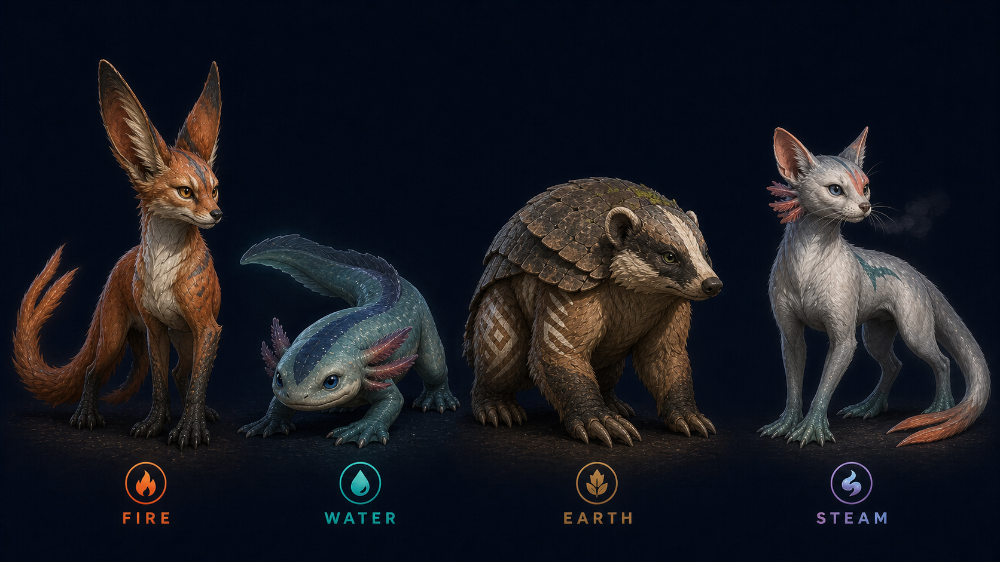

# GOCHYA Elemental Creatures — Grounded V3

## Статус

Актуальное каноническое направление MVP-персонажей. V2 заменён: он был слишком фэнтезийным. UI-концепты должны использовать биологию, пропорции и материалы этого листа.

## MVP-набор

По `CORE_SPEC.md`, `GDD.md` и `CONTENT_MANIFEST.md` в MVP входят три базовые стихии — Fire, Water, Earth — и один гибрид Steam (Fire + Water).

| Стихия | Биологическая основа | Силуэт | Постоянные приметы |
|---|---|---|---|
| Fire | фенек + варан | высокий, сухой, длинноногий | очень длинные уши, янтарные миндалевидные глаза, угольные лапы, асимметричная охристая полоса, раздвоенный медный хвост |
| Water | аксолотль + выдра | низкий, широкий, обтекаемый | шесть жаберных ветвей, умеренно круглые синие глаза, перепончатые лапы, плоский хвост, тёмная продольная полоса |
| Earth | барсук + броненосец | тяжёлый, приземистый, бронированный | маленькие горизонтальные глаза, округлые ушные раковины, спинные пластины, копательные когти, маска вокруг одного глаза |
| Steam | наземно-водный мустелид, наследующий Fire + Water | стройный, но устойчивый | длинные уши Fire, небольшие жабры Water, серо-белая шерсть, коралловая лицевая метка, бирюзовая полоса, хвост-руль с раздвоенным кончиком |

## Ограничения стиля

- Стихия выражается адаптацией тела, окраской и паттерном, а не буквальной магией.
- Запрещены горящее тело, каменный голем, облачное тело, левитация и чрезмерное свечение.
- Пропорции близки к убедительному животному; стилизация умеренная.
- Материалы тактильные и естественные: шерсть, влажная кожа, чешуя, кератин, бронепластины.
- Персонажи остаются эмоциональными, но без chibi, baby mascot и кукольных глаз.
- В интерфейсе допустимы небольшие элементальные VFX как UI-feedback, но они не меняют физическое тело персонажа.

## Полный набор проекта

- Базовые: Fire, Water, Earth, Air, Light, Dark, Arcane.
- Гибриды: Steam, Magma, Storm, Mud, Smoke, Sand, Eclipse, Inferno, Prism, Crystal.
- Magma и Mud существуют в core/balance, но не входят в актуальный MVP content budget.

## Generation record

- Режим: built-in image generation.
- Use case: `style-transfer`.
- Версия: V3 grounded.
- Размер: 1672×941 PNG.
