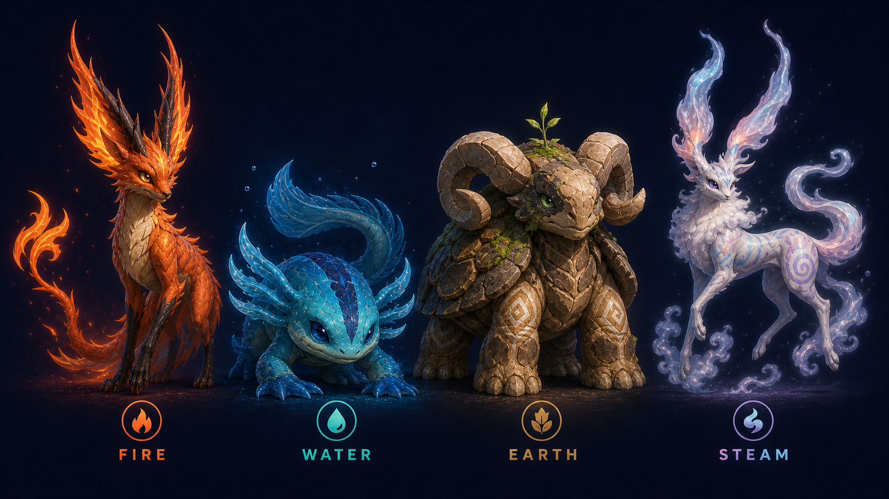

# GOCHYA Elemental Creatures — Mature Direction V2

## Статус

Устаревшее промежуточное направление: силуэты стали различимыми, но дизайн остался слишком фэнтезийным. Актуальный канон — `ELEMENTAL_CREATURES_GROUNDED_V3.md`.

## Уникальные идентификаторы

| Стихия | Вид и силуэт | Глаза | Уникальные приметы |
|---|---|---|---|
| Fire | высокий лис-дрейк | узкие янтарные | раздвоенные пламенные уши, угольные лапы, асимметричный золотой рисунок, раздвоенный хвост |
| Water | приземистая амфибия | округлые тёмно-синие | шесть наружных жабр, перепончатые лапы, широкий плавниковый хвост, светящиеся боковые пятна |
| Earth | тяжёлый рам-тortoise страж | маленькие горизонтальные зелёные | каменные рога, панцирные плечи, мох, маска вокруг одного глаза, центральный росток |
| Steam | стройный облачный дух | миндалевидные лавандовые | длинные неравные паровые уши, туманная грива, две паровые ленты-хвоста, кораллово-голубая иризация |

## Общие правила

- Стихии — разные виды, а не перекраски одной модели.
- Силуэт каждой стихии распознаётся без цвета.
- Не повторяются формы ушей, глаз, хвостов и пропорции тела.
- Голова и глаза умеренного размера; запрещён chibi/baby-mascot подход.
- Выражения спокойные и уверенные, анатомия имеет вес и убедительные суставы.
- Материалы различаются физически: шерсть/чешуя, влажная кожа, минерал, полупрозрачный пар.

## Generation record

- Режим: built-in image generation.
- Use case: `style-transfer`.
- Версия: V2 mature.
- Размер: 1672×941 PNG.
