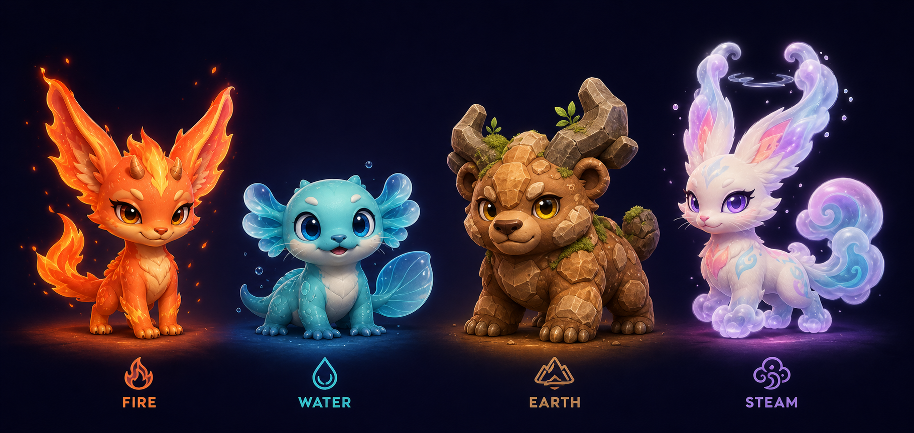
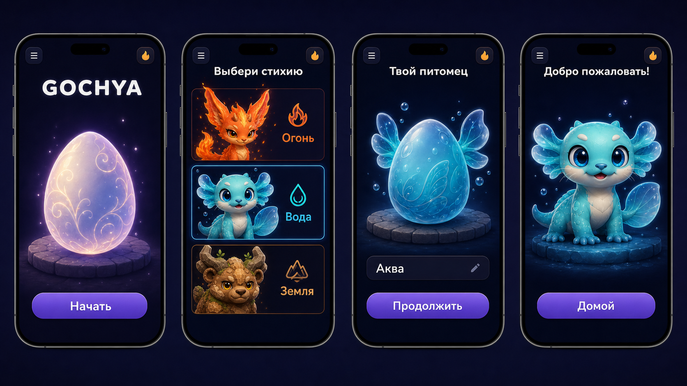
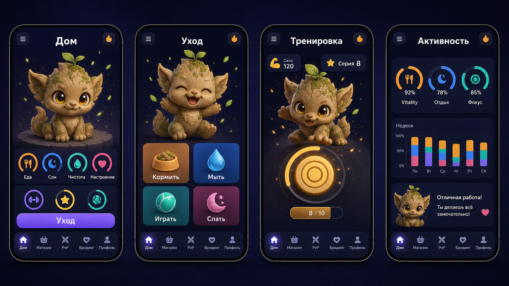
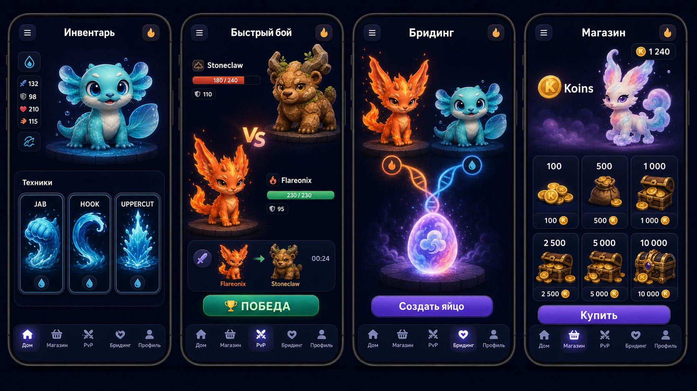
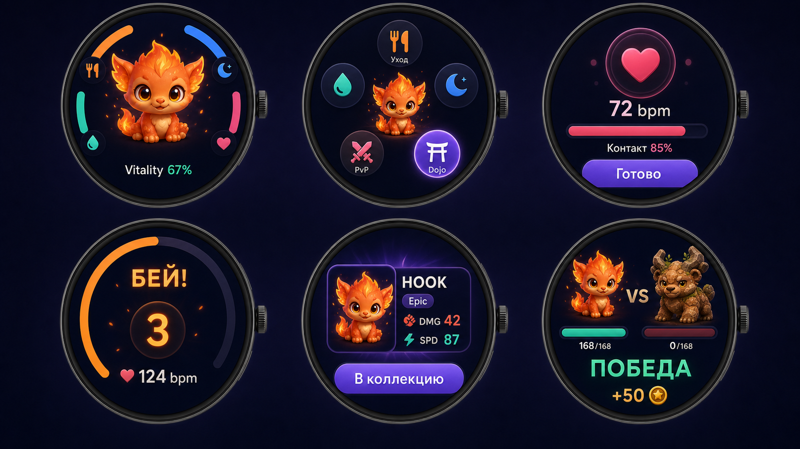
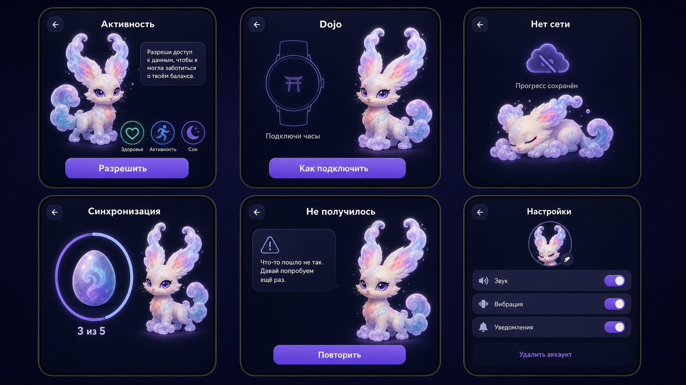

# GOCHYA Concept Pack V2

> Визуальное направление для MVP. Изображения задают species identity, стиль и композицию; точные layout, тексты, возрастные пропорции и экономика определяются нормативными спецификациями.

## Каноническая различимость видов

Fire, Water, Earth и Steam — разные виды, а не цветовые варианты одной модели. Лист фиксирует уши/жабры/рога, форму глаз, хвост, материал и крупные markings. Возрастные пропорции уточняются по `ART_BIBLE.md`.

## Телефон — onboarding

## Телефон — основной цикл

## Телефон — meta

Экран магазина является композиционным референсом. Состав валют и товаров берётся из `MVP.md`, а не из сгенерированных ценников.

## Wear OS

## Consent и системные состояния

## Статус

- Species lineup V2 фиксирует distinct-species direction.
- UI-листы — high-fidelity direction, не pixel-perfect макеты.
- Перед production нужны component specs, safe-zone layouts и экспортируемые model sheets.
- Все изображения созданы built-in image generation в категориях `ui-mockup`/`stylized-concept`.
