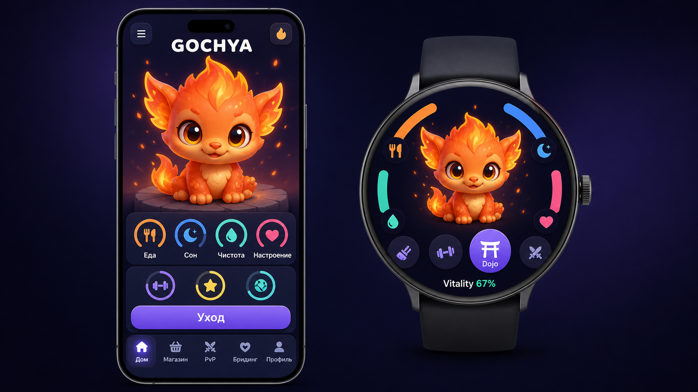

# GOCHYA Phone + Watch UI Concept V1

## Назначение

Высокодетализированный визуальный ориентир компоновки главного экрана для телефона и круглых Wear OS часов. Это UI layout target, а не актуальный character target: chibi-персонаж заменён направлением `ELEMENTAL_CREATURES_GROUNDED_V3.md`.

## Зафиксированные решения

- Одинаковая идентичность выбранного персонажа должна сохраняться на обоих устройствах.
- Показанный Fire-персонаж устарел; production-концепты используют grounded-пропорции из `ELEMENTAL_CREATURES_GROUNDED_V3.md`.
- Телефон показывает полный Home: питомец, четыре потребности, активность, главное действие и нижнюю навигацию.
- Часы сохраняют питомца главным объектом, используют четыре цветные дуги потребностей и крупный доступ к Dojo.
- Палитра соответствует `ART_BIBLE.md`: тёмно-синий фон, фиолетовый primary, отдельные цвета потребностей и Fire-акцент.

## Что не является контрактом

- Форма конкретной модели телефона/часов и аппаратные рамки.
- Положение элементов с точностью до пикселя.
- Сгенерированные иконки и шрифтовые метрики.
- Количество activity rings: production Home следует актуальному `UX_UI.md` и MVP scope.

Перед реализацией интерфейс переводится в компоненты и проверяется по safe zones, tap targets, contrast и локализации из `UX_UI.md`/`ART_BIBLE.md`.

## Generation record

- Режим: built-in image generation.
- Use case: `ui-mockup`.
- Версия артефакта: V1.
- Размер: 1672×941 PNG.
