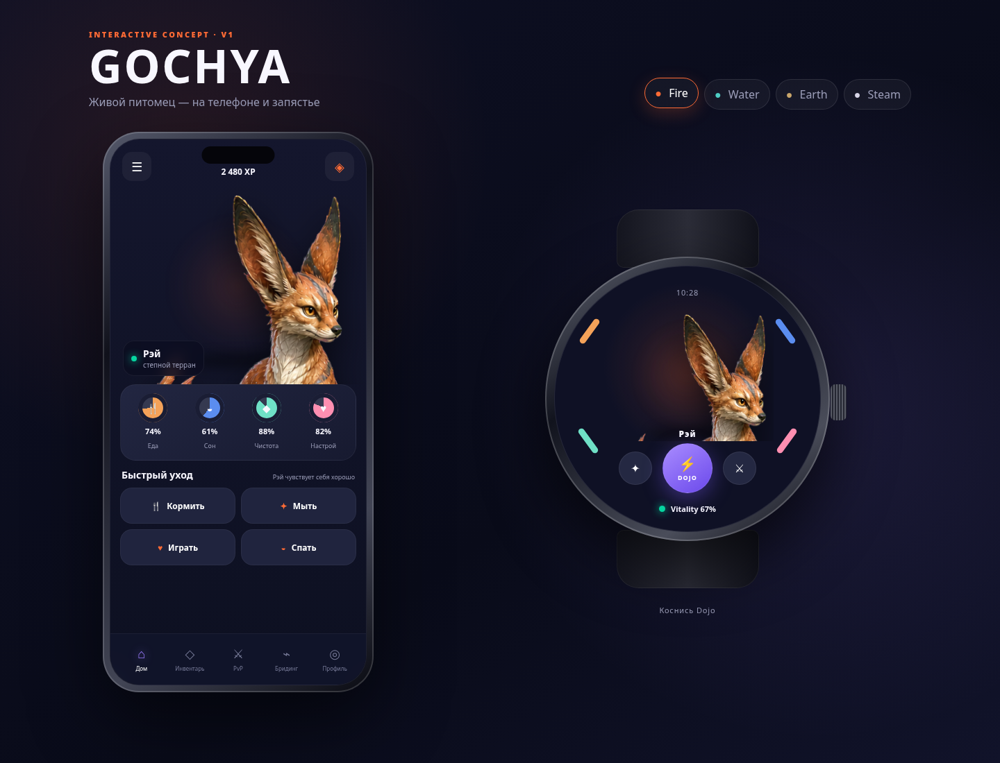

# GOCHYA Animated UI Prototype

Интерактивный безсерверный макет главного экрана телефона и круглых Wear OS часов.



## Запуск

Открыть `index.html` в современном браузере. Сборка и внешние зависимости не нужны.

Для корректного поведения браузеров при локальной разработке можно запустить из корня репозитория:

```bash
python3 -m http.server 8080
```

Затем открыть `http://localhost:8080/docs/06-art/prototypes/animated-ui/`.

## Интерактивность

- переключение Fire / Water / Earth / Steam;
- синхронный персонаж на телефоне и часах;
- idle breathing/sway и фоновые частицы;
- реакции на кормление, мытьё, игру и сон;
- Dojo/PvP-анимация на часах;
- обновление значений потребностей;
- reduced-motion режим через системную настройку.

## Статус

Это UX/motion prototype, не production-код. Растровые персонажи сгенерированы в grounded V3 направлении и анимируются как цельные cutout-слои; production skeletal animation потребует разбиения персонажей на отдельные части и rig в Rive/Spine.
